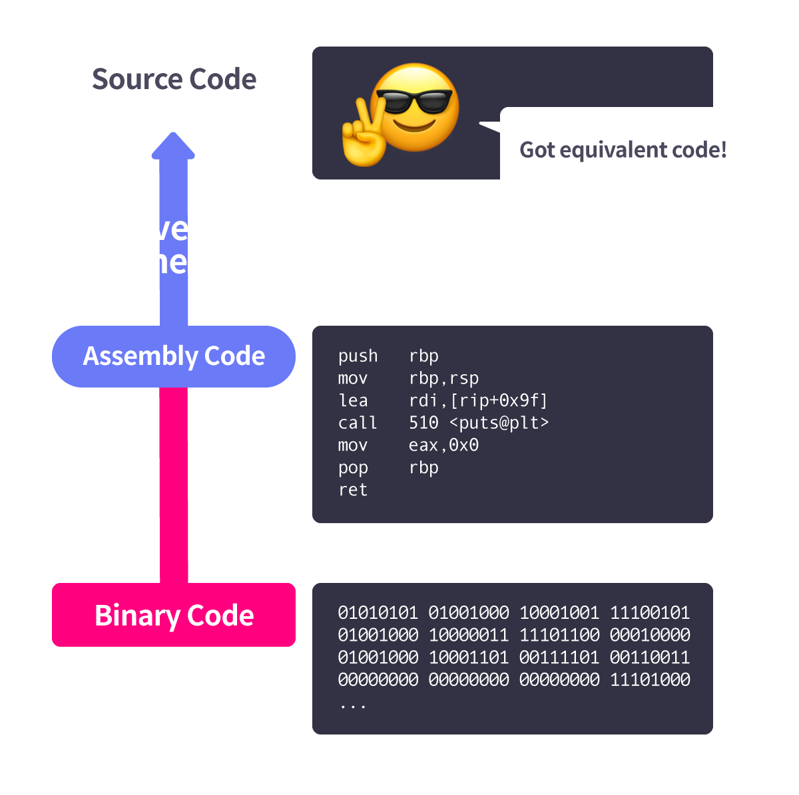

# 프로그램과 컴파일

## 프로그램

``프로그램`` : 연산 장치가 **수행해야 하는 동작**을 정의한 일종의 문서

과거에는 **전선을 연결하여 컴퓨터에 전달**, **천공 카드(Punched card)** 등을 통해 ``프로그램을 저장``했다.  
-> 이러한 방식을 ``에니악(ENIAC)`` 이라고 하는데, 비효율적이다.

1950년대에 Stored-Program Computer를 통해 프로그램을 저장하면서 위의 단점을 해결했다.  

프로그램은 저장 장치에 저장될 때, **이진 형태**로 저장되므로 ``바이너리`` 라고 하기도 한다.

## 컴파일러와 인터프리터

``프로그래밍 언어`` : **프로그램을 개발**하기 위해 사용하는 언어  
-> CPU가 수행해야 할 **명령들을 프로그래밍 언어로 작성**한 것을 ``소스 코드`` 라고 한다.

``컴파일`` : 소스 코드를 **기계어로 변역**하는 것  

``컴파일러`` : **컴파일을 해주는 소프트웨어**(GCC, Clang, MSVC ...)

``인터프리팅`` : 사용자의 입력, 작성한 스크립트를 **그때 그때 번역**해서 CPU에 전달(컴파일이 필요없는 ``Python, Javascript`` 등)

``인터프리터`` : **인터프리팅을 해주는 소프트웨어**  

### 컴파일 과정

C언어가 바이너리로 번역되는 과정
1. 전처리
2. 컴파일
3. 어셈블
4. 링크

이제부터 아래의 코드를 예시로 설명

```c
// Name: add.c

#include "add.h"

#define HI 3

int add(int a, int b) { return a + b + HI; }  // return a+b
```
```c
// Name: add.h

int add(int a, int b);
```

## 전처리

``전처리`` : 컴파일러가 소스 코드를 컴파일하기 전에, **필요한 형식으로 가공**하는 과정  

1. 주석 제거  
주석은 **프로그램의 동작과 필요 없으므로 모두 제거**
2. 매크로 치환  
``#define`` 등과 같은 매크로의 이름은 값으로 치환
3. 파일 병합  
보통 프로그램에 **여러 개의 소스와 헤더 파일**이 있는데, 이를 **컴파일 -> 병합** or **병합 -> 컴파일** 을 한다.  

```bash
$ gcc -E add.c > add.i
```

위와 같이 ``add.c`` 를 **-E** 옵션으로 전처리하면, 다음과 같이 ``add.i`` 가 나온다.  

```
# 1 "add.c"
# 1 "<built-in>"
# 1 "<command-line>"
# 31 "<command-line>"
# 1 "/usr/include/stdc-predef.h" 1 3 4
# 32 "<command-line>" 2
# 1 "add.c"
# 1 "add.h" 1
int add(int a, int b);
# 2 "add.c" 2


int add(int a, int b) { return a + b + 3; }
```

주석이 제거되었고, 매크로였던 ``HI``가 3으로 치환되었다. 또한 헤더 파일의 내용이 병합됨

## 컴파일

``컴파일`` : C로 작성된 **소스 코드를 어셈블리어로 번역**하는 것  

```c
// Name: opt.c
// Compile: gcc -o opt opt.c -O2

#include <stdio.h>

int main() {
  int x = 0;
  for (int i = 0; i < 100; i++) x += i; // x에 0부터 99까지의 값 더하기
  printf("%d", x);
}
```
```bash
0x0000000000000560 <+0>:     lea    rsi,[rip+0x1bd]        ; 0x724
0x0000000000000567 <+7>:     sub    rsp,0x8
0x000000000000056b <+11>:    mov    edx,0x1356  ; hex((0+99)*50) = '0x1356' = sum(0,1,...,99) -> 여기서 반복문을 직접 번역한 것이 아니라, 반복문의 결과를 계산해서 대입 연산만 진행
0x0000000000000570 <+16>:    mov    edi,0x1
0x0000000000000575 <+21>:    xor    eax,eax
0x0000000000000577 <+23>:    call   0x540 <__printf_chk@plt>
0x000000000000057c <+28>:    xor    eax,eax
0x000000000000057e <+30>:    add    rsp,0x8
0x0000000000000582 <+34>:    ret
```

위의 ``opt.c``를 컴파일할 때 **-o** 옵션을 통해 최적화를 적용했다.

즉, 더 짧고 실행 시간도 짧은 코드로 번역

```bash
$ gcc -S add.i -o add.S
$ cat add.S
```
```bash
        .file   "add.c"
        .intel_syntax noprefix
        .text
        .globl  add
        .type   add, @function
add:
.LFB0:
        .cfi_startproc
        push    rbp
        .cfi_def_cfa_offset 16
        .cfi_offset 6, -16
        mov     rbp, rsp
        .cfi_def_cfa_register 6
        mov     DWORD PTR -4[rbp], edi
        mov     DWORD PTR -8[rbp], esi
        mov     edx, DWORD PTR -4[rbp]
        mov     eax, DWORD PTR -8[rbp]
        add     eax, edx
        add     eax, 3
        pop     rbp
        .cfi_def_cfa 7, 8
        ret
        .cfi_endproc
.LFE0:
        .size   add, .-add
        .ident  "GCC: (Ubuntu 7.5.0-3ubuntu1~18.04) 7.5.0"
        .section        .note.GNU-stack,"",@progbits
```

위와 같이 **-S** 옵션을 이용해 어셈블리어로 컴파일할 수 있다.

## 어셈블 / 링크

### 어셈블

``어셈블`` : 어셈블리어 코드를 **목적 파일**로 변환(기계어로 변환)

아래는 **-c** 옵션으로 ``add.S`` 를 목적 파일로 변환한 예시다. 

```bash
$ gcc -c add.S -o add.o
$ file add.o
add.o: ELF 64-bit LSB relocatable, x86-64, version 1 (SYSV), not stripped
$ hexdump -C add.o
00000000  7f 45 4c 46 02 01 01 00  00 00 00 00 00 00 00 00  |.ELF............|
00000010  01 00 3e 00 01 00 00 00  00 00 00 00 00 00 00 00  |..>.............|
00000020  00 00 00 00 00 00 00 00  10 02 00 00 00 00 00 00  |................|
00000030  00 00 00 00 40 00 00 00  00 00 40 00 0b 00 0a 00  |....@.....@.....|
00000040  55 48 89 e5 89 7d fc 89  75 f8 8b 55 fc 8b 45 f8  |UH...}..u..U..E.|
00000050  01 d0 5d c3 00 47 43 43  3a 20 28 55 62 75 6e 74  |..]..GCC: (Ubunt|
00000060  75 20 37 2e 35 2e 30 2d  33 75 62 75 6e 74 75 31  |u 7.5.0-3ubuntu1|
00000070  7e 31 38 2e 30 34 29 20  37 2e 35 2e 30 00 00 00  |~18.04) 7.5.0...|
00000080  14 00 00 00 00 00 00 00  01 7a 52 00 01 78 10 01  |.........zR..x..|
00000090  1b 0c 07 08 90 01 00 00  1c 00 00 00 1c 00 00 00  |................|
000000a0  00 00 00 00 14 00 00 00  00 41 0e 10 86 02 43 0d  |.........A....C.|
000000b0  06 4f 0c 07 08 00 00 00  00 00 00 00 00 00 00 00  |.O..............|
...
```

### 링크

``링크`` : 여러 **목적 파일을 연결**해서 **실행 가능한 바이너리로 만드는** 과정  

```c
// Name: hello-world.c
// Compile: gcc -o hello-world hello-world.c

#include <stdio.h>

int main() { printf("Hello, world!"); }
```

위의 코드에서 **printf**는 위의 파일에 정의되어 있지 않다.  

**libc** 라는 gcc 기본 라이브러리 경로에 있는데, 그걸 연결해주는 것이다.  

아래는 ``add.o`` 를 링크하는 과정이다.  

``--unresolved-symbols`` 는 링커가 ``main`` 함수를 찾지 못한 경우 에러가 발생하는 것을 방지하기 위한 옵션이다.  

```bash
$ gcc add.o -o add -Xlinker --unresolved-symbols=ignore-in-object-files
$ file add
add: ELF 64-bit LSB shared object, x86-64, version 1 (SYSV), dynamically linked, interpreter /lib64/l, ...
```

# 디스어셈블과 디컴파일

## 디스어셈블

``디스어셈블`` : 어셈블의 역과정(**기계어를 다시 어셈블리어로 번역**하는 것)  

  

다음은 디스어셈블한 예시다.  

```bash
$ objdump -d ./add -M intel
...
000000000000061a <add>:
 61a:   55                      push   rbp
 61b:   48 89 e5                mov    rbp,rsp
 61e:   89 7d fc                mov    DWORD PTR [rbp-0x4],edi
 621:   89 75 f8                mov    DWORD PTR [rbp-0x8],esi
 624:   8b 55 fc                mov    edx,DWORD PTR [rbp-0x4]
 627:   8b 45 f8                mov    eax,DWORD PTR [rbp-0x8]
 62a:   01 d0                   add    eax,edx
 62c:   5d                      pop    rbp
 62d:   c3                      ret
 62e:   66 90                   xchg   ax,ax
...
```

## 디컴파일

``디컴파일`` : **기계어를 고급 언어로 번역**

디컴파일은 최적화 같은 컴파일 과정에 의해 **완벽하게 할 수 없다**.(큰 틀 정도는 볼 수 있다.)  

**Hex Rays, Ghidra, IDA Freeware** 등과 같은 디컴파일러가 있다.

# 마치며

- ``프로그램``: 컴퓨터가 **실행해야 할 명령어의 집합**, 바이너리라고도 불림
- ``전처리``: 소스 코드가 **컴파일에 필요한 형식으로 가공**되는 과정
- ``컴파일``: 소스 코드를 **어셈블리어로 번역**하는 과정
- ``어셈블``: **어셈블리 코드를 기계어로 번역**하고, 실행 가능한 형식으로 변형하는 과정
- ``링크``: **여러 개의 목적 파일**을 하나로 묶고, 필요한 라이브러리와 **연결**해주는 과정
- ``디스어셈블``: **바이너리를 어셈블리어로 번역**하는 과정
- ``디컴파일``: **바이너리를 고급 언어로 번역**하는 과정
