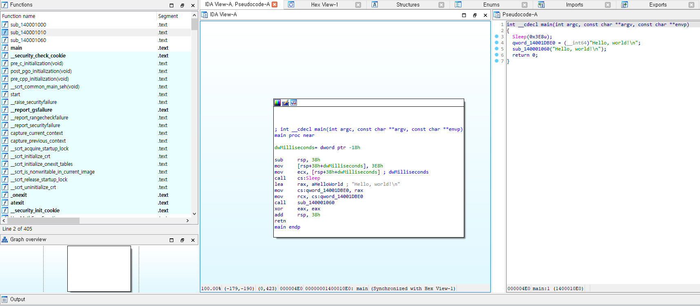
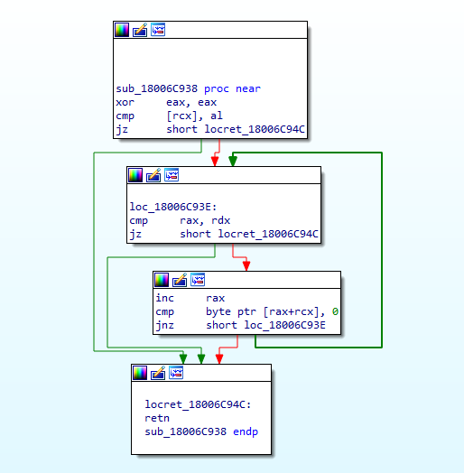
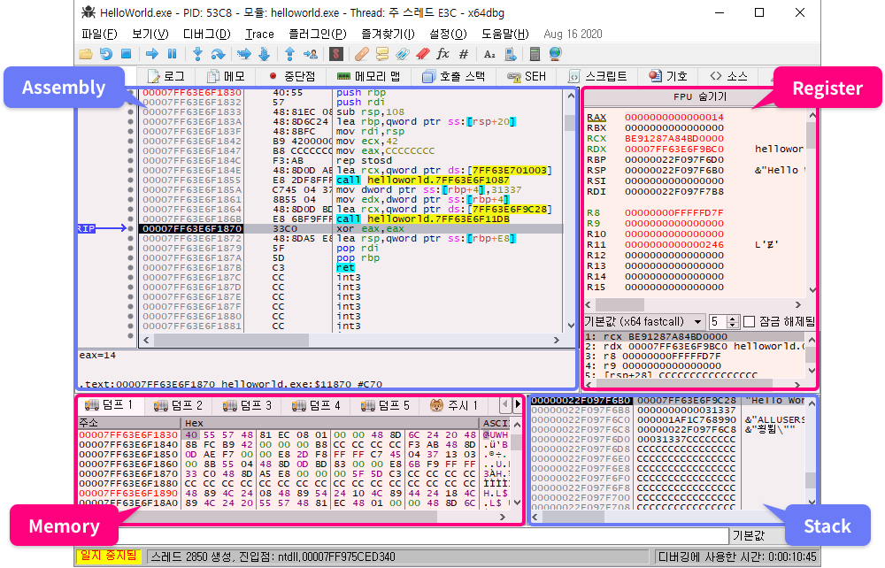
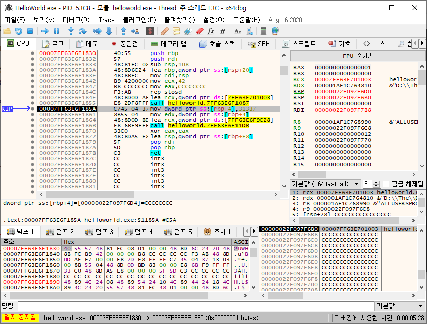
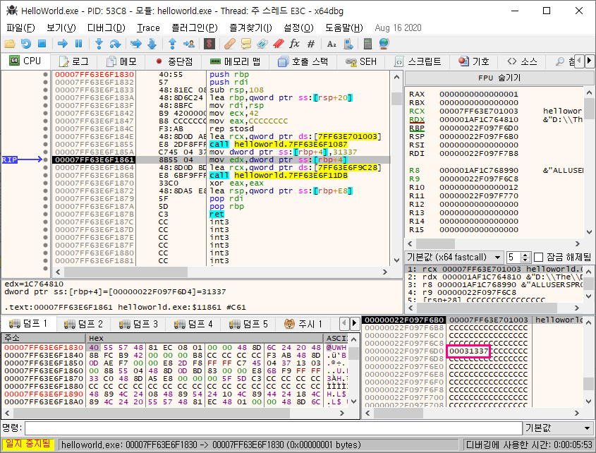
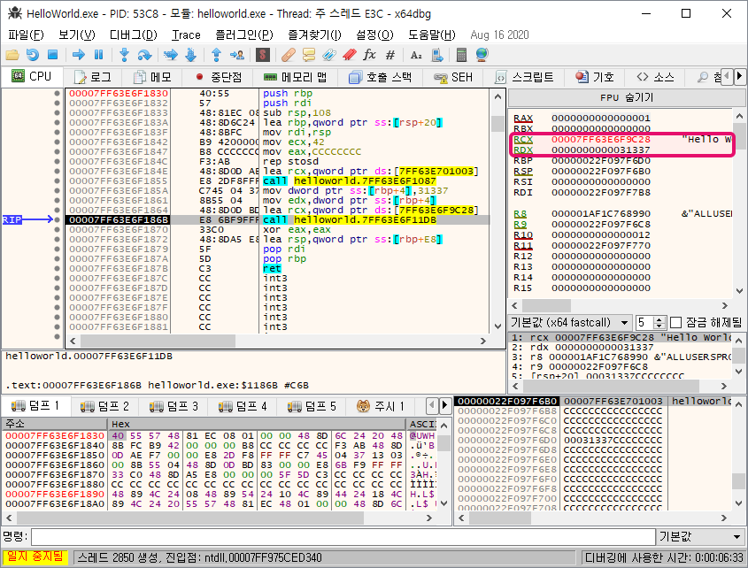
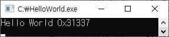

# 정적 분석

## 정적 분석

``정적 분석`` : 프로그램을 **실행시키지 않고** 분석하는 방법  

### 장점

1. **전체구조를 파악**하기 쉽다.
2. **분석 환경**의 제약에서 자유롭다.
3. 바이러스와 같은 **악성 프로그램**의 위협으로부터 **안전**하다.

### 단점

1. **난독화**가 적용되면 분석이 **어렵다**.
2. 다양한 **동적 요소를 고려하기 어렵다**.

## 정적 분석의 예

``IDA`` 가 대표적인 정적 분석 도구이다.  

  

위와 같이 **어셈블리어** 코드과, **디컴파일**한 코드를 볼 수 있다.  

  

또한 **함수, 상호 참조** 등을 볼 수 있는 **제어 흐름 그래프**도 있다.

# 동적 분석

## 동적 분석

``동적 분석`` : **프로그램을 실행**시키면서 분석하는 방법  

### 장점

1. 자세히 **분석하지 않고**, **개략적인 동작**을 파악(**출력 등을 빠르게 확인**할 수 있어서, 이를 기반으로 추론 가능)

### 단점

1. **분석 환경 구축 어려움**(가상환경 등)

또한 정적 분석에서 **난독화** 처럼 동적 분석에는 **안티 디버깅** 이 있다.  
-> **디버깅 중**이면 프로그램을 **강제 종료**

```c
if (is_debugging()) // 디버깅인지 확인
  exit(-1); // 프로그램 종료
Func();
```

## 동적 분석의 예

``x64dbg`` 가 윈도우의 대표적인 동적 분석 도구이다.  

```c
//helloworld.c

#include <stdio.h>

int main()
{
  int n = 0x31337;
  printf("Hello World 0x%x\n", n);
  return 0;
}
```

위의 ``helloworld.c`` 를 디버깅한 ``helloworld.exe`` 를 x64dbg로 동적 분석하면 다음과 같이 나온다.  

  

위와 같이 **어셈블리어, 레지스터, 메모리, 스택** 등을 볼 수 있다.  

이렇게 아래와 같은 과정을 거친다.

1. int n = 0x31337
  

2. 스택에 0x31337 저장
  

3. printf 호출 직전 인자
  

4. printf 호출 결과
  